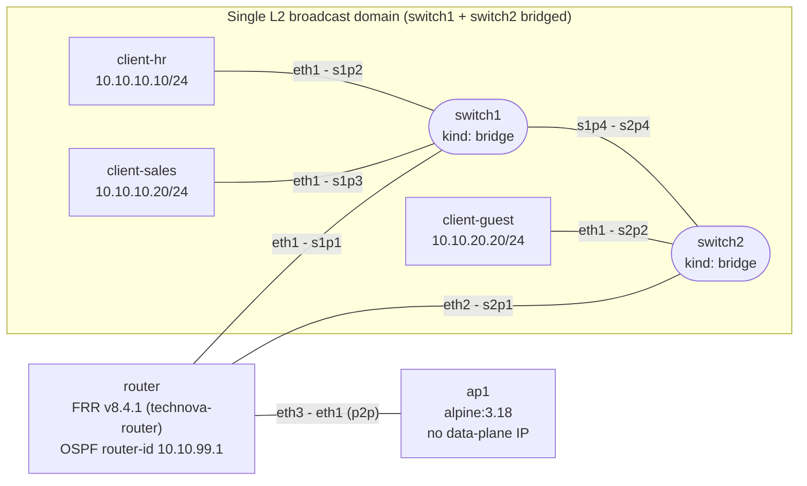
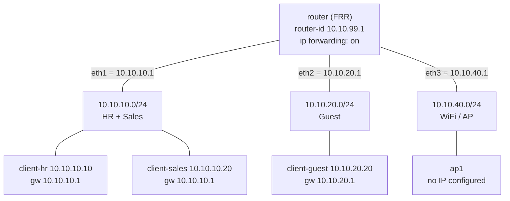
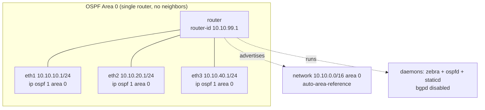
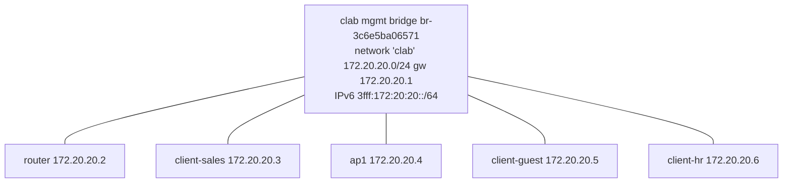

# Network Design — `technova-network`

> **Source of truth:** [`lab/technova.clab.yaml`](../lab/technova.clab.yaml) (topology) and
> [`configs/router/frr.conf`](../configs/router/frr.conf) +
> [`configs/router/daemons`](../configs/router/daemons) (routing). This document describes the
> lab **as declared in those files**. Runtime artifacts under `lab/clab-technova-network/`
> (state, generated inventory, management IPs) are git-ignored and ephemeral.

## 1. Scope and scenario
A small-business network lab built with a NetDevOps / Infrastructure-as-Code approach: the
entire topology (nodes, links, addressing, routing) is declared in plain-text files and
deployed reproducibly with Containerlab. Three user segments (HR, Sales, Guest) plus a
WiFi/AP segment are interconnected by a single FRRouting router running OSPF.

## 2. Tooling
| Concern | Tool | Where |
|---|---|---|
| Topology & deploy | Containerlab | `lab/technova.clab.yaml` |
| L3 routing | FRRouting v8.4.1 (zebra, ospfd, staticd) | `configs/router/frr.conf`, `configs/router/daemons` |
| Node images | `frrouting/frr:v8.4.1`, `alpine:3.18` | topology file |
| Version control | Git | repository |
| Automation | Ansible — **WIP** (inventory auto-generated by Containerlab, no playbooks yet) | `ansible/` (empty) |

## 3. Topology

### 3.1 Nodes
| Node | Kind | Image | Role |
|---|---|---|---|
| `router` | linux | `frrouting/frr:v8.4.1` | L3 router, OSPF, hostname `technova-router` |
| `switch1` | bridge | — | L2 access bridge (HR, Sales, router `eth1`) |
| `switch2` | bridge | — | L2 access bridge (Guest, router `eth2`) |
| `ap1` | linux | `alpine:3.18` | WiFi access point (router `eth3`) |
| `client-hr` | linux | `alpine:3.18` | HR endpoint |
| `client-sales` | linux | `alpine:3.18` | Sales endpoint |
| `client-guest` | linux | `alpine:3.18` | Guest endpoint |

### 3.2 Links
| Endpoint A | Endpoint B | Notes |
|---|---|---|
| `router:eth1` | `switch1:s1p1` | router uplink to switch1 |
| `client-hr:eth1` | `switch1:s1p2` | HR access |
| `client-sales:eth1` | `switch1:s1p3` | Sales access |
| `switch1:s1p4` | `switch2:s2p4` | inter-switch L2 link (bridge-to-bridge) |
| `router:eth2` | `switch2:s2p1` | router uplink to switch2 |
| `client-guest:eth1` | `switch2:s2p2` | Guest access |
| `router:eth3` | `ap1:eth1` | point-to-point to AP |

### 3.3 Topology diagram

## 4. Layer-2 design
`switch1` and `switch2` are Containerlab `bridge` nodes — plain Linux bridges with **no VLAN
filtering**. They are joined by a veth pair (`s1p4` ↔ `s2p4`), which merges them into a
**single L2 broadcast domain**. Consequences:

- `router:eth1` (10.10.10.1), `router:eth2` (10.10.20.1) and the three clients
  (`client-hr`, `client-sales`, `client-guest`) all share one broadcast domain.
- Separation between `10.10.10.0/24` and `10.10.20.0/24` is therefore **L3 only** (distinct
  subnets and gateways on the same router), **not** L2 isolation. There are no 802.1Q VLANs.
- The only genuinely separate L2 segment is the point-to-point link `router:eth3` ↔ `ap1:eth1`
  (`10.10.40.0/24`).

## 5. Layer-3 addressing
| Subnet | Segment | Router interface (gateway) | Hosts |
|---|---|---|---|
| `10.10.10.0/24` | HR + Sales | `eth1` = 10.10.10.1 | `client-hr` .10, `client-sales` .20 |
| `10.10.20.0/24` | Guest | `eth2` = 10.10.20.1 | `client-guest` .20 |
| `10.10.40.0/24` | WiFi / AP | `eth3` = 10.10.40.1 | `ap1` (no IP configured yet) |

Clients are addressed **statically** via `exec` in the topology file (`ip addr add …`,
`ip route replace default via …`). The `10.10.0.0/16` supernet is used for the OSPF `network`
statement; the OSPF `router-id` is `10.10.99.1` (not bound to a loopback interface in this lab).

## 6. Routing (OSPF / FRR)
FRR v8.4.1 with daemons **zebra, ospfd, staticd** enabled (`bgpd` disabled), `vtysh` enabled.
Key points of `frr.conf`:

- `hostname technova-router`; password / enable password `technova`; logging to stdout.
- Global `ip forwarding` (also enforced via `sysctl -w net.ipv4.ip_forward=1` in the topology `exec`).
- `eth1`/`eth2`/`eth3` each carry `ip ospf 1 area 0`.
- `router ospf`: `router-id 10.10.99.1`, `network 10.10.0.0/16 area 0`, `auto-area-reference`.

> **Note:** there is a single OSPF router, so OSPF currently has **no neighbors**. It advertises
> the connected `10.10.0.0/16` networks but has no peer to exchange routes with; inter-subnet
> traffic (e.g. HR ↔ Guest) is routed directly by the router's connected interfaces. OSPF is in
> place to scale toward additional routers / a WAN edge.

## 7. Management plane
Containerlab attaches every `linux` node to an out-of-band management network (bridge `clab`,
default `172.20.20.0/24`, gw `.1`; IPv6 `3fff:172:20:20::/64`). Management IPs are
**auto-assigned at deploy time** and are not part of the IaC source (the runtime dir
`lab/clab-technova-network/` is git-ignored), so they may change between deployments.
Last observed assignment:

| Node | mgmt IPv4 |
|---|---|
| `router` | 172.20.20.2 |
| `client-sales` | 172.20.20.3 |
| `ap1` | 172.20.20.4 |
| `client-guest` | 172.20.20.5 |
| `client-hr` | 172.20.20.6 |

`switch1` / `switch2` (`kind: bridge`) have no management IP.

## 8. Configuration management / IaC notes
- The router config is **bind-mounted** into the FRR container:
  `../configs/router/daemons → /etc/frr/daemons` and `../configs/router/frr.conf → /etc/frr/frr.conf`,
  followed by `chown -R frr:frr /etc/frr`.
- IP forwarding is enabled both declaratively (`ip forwarding` in `frr.conf`) and imperatively
  (`sysctl` in the topology `exec`).
- Client addressing is **imperative** (`exec` ip commands) rather than declarative — acceptable
  for a lab, but a natural candidate for Ansible/templating.
- **Ansible:** `ansible/` is a placeholder (no playbooks). Containerlab generates an inventory at
  deploy time under `lab/clab-technova-network/ansible-inventory.yml`.

## 9. Known limitations & next steps
- **Shared L2 domain:** switch1 + switch2 form one broadcast domain (no VLAN isolation). To truly
  isolate HR/Sales/Guest at L2, use VLAN-aware bridges or a separate bridge per segment.
- **OSPF:** one router, no neighbors — add a second router / WAN edge to exercise OSPF adjacencies.
- **`ap1`:** no data-plane IP and no wireless configuration; it is a placeholder node.
- **Client config:** move the imperative `exec` addressing into Ansible playbooks.
- **Diagrams:** `docs/diagrams/*.mmd` are the editable sources — keep them in sync with the
  diagrams embedded here.
- **Repo hygiene:** `lab/docker-start.log` is committed; consider git-ignoring log files.

## 10. Diagrams
Editable Mermaid sources live in [`docs/diagrams/`](diagrams/) (`topology`, `addressing`, `ospf`,
`management`). See [`docs/diagrams/README.md`](diagrams/README.md) for rendering instructions.
